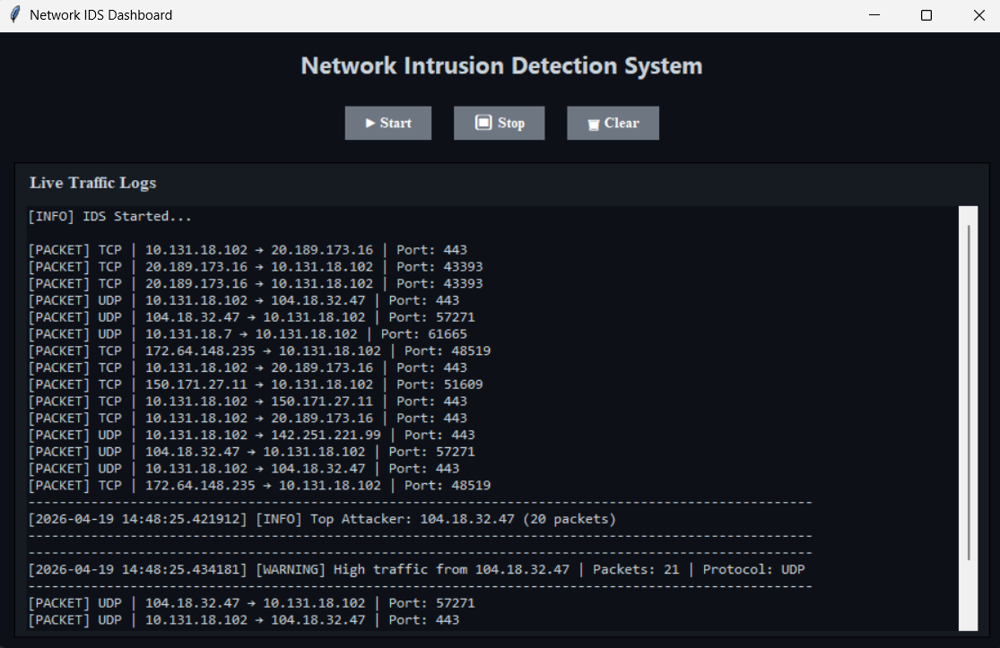

# 🛡️ Network Intrusion Detection System (IDS)

A real-time Network Intrusion Detection System built using Python that monitors network traffic, detects suspicious activities like high traffic and port scans, and displays them in a modern GUI dashboard.

---

## 🚀 Features

* 📡 Real-time packet capture using Scapy
* 🚨 Detects high traffic from IPs
* 🔍 Port scan detection
* 🎯 Identifies top attacker
* 🖥️ Modern GUI dashboard (Tkinter)
* 🎨 Color-coded alerts (Warning / Alert / Info)
* 📊 Clean and structured packet logs
* 🧾 Logs saved to file

---

## 🛠️ Tech Stack

* Python
* Scapy
* Tkinter

---

## ⚙️ Installation

1. Clone the repository:

```bash
git clone https://github.com/your-username/network-ids.git
cd network-ids
```

2. Install dependencies:

```bash
pip install -r requirements.txt
```

---

## ▶️ Usage

Run the GUI:

```bash
python gui.py
```

To simulate attacks (in another terminal):

```bash
nmap -p- 127.0.0.1
```

---

## 📸 Screenshots



Example:
* Live packet monitoring
* Alert detection
* Clean dashboard UI

---

## 🧠 How it Works

* Captures packets using Scapy
* Extracts IP, protocol, and port information
* Applies threshold-based detection
* Generates alerts for suspicious activity
* Displays results in real-time GUI

---

## 🔮 Future Improvements

* Web-based dashboard (Flask + HTML/CSS)
* Live statistics panel
* Export logs feature
* Advanced anomaly detection

---

## 👨‍💻 Author

Naethen Mathew Anil

---

## ⭐ Acknowledgements

This project was developed as part of a mini project for learning network security concepts.
